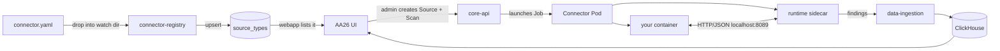

# Connectors for AA26

Welcome. This site is for people building **connectors** — the things that let AA26 (Netwrix DSPM) scan a new kind of data store. If your goal is "make AA26 understand Box / Snowflake / Databricks / our custom system" then you're in the right place.

A connector is **just a container image** plus a **manifest file**. There's no SDK you have to use, no language you have to write in, and no internal Netwrix endpoint you have to call. You write whatever code you want, talk HTTP/JSON to a small sidecar that runs next to you, and findings show up in AA26.

## What this looks like end to end

Three pieces. You author the **left two** — the manifest and your container. Everything to the right is the framework's problem.

## Why does this exist?

Today, building a new connector for AA26 means:

- Reading another connector's source to figure out the runtime contract
- Building one container image *per operation* (test-connection, scan, fetch, …)
- Naming everything by an unwritten convention so the catalog can find your image
- Being a Python author or learning to be one
- Knowing how to hit four internal services (`data-ingestion`, `connector-state`, Redis, core-api)

The framework you're reading about does the opposite of all of that. It picks an explicit contract, lets you build in any language, and gives you one sidecar to talk to that handles every internal service on your behalf. The trade is: you have to write a `connector.yaml` and you have to follow a small published HTTP API. In return: write your connector in a day instead of a week.

## Get started

- **[Quickstart](quickstart.md)** — write a working connector in 15 minutes, in bash
- **[Uploading](uploading.md)** — package and upload your bundle via the web UI or curl
- **[Manifest reference](manifest-reference.md)** — every field of `connector.yaml`
- **[Runtime contract](runtime-contract.md)** — the HTTP API your container talks to
- **[Finding schema](finding-schema.md)** — what your output looks like
- **[OAuth2](oauth2.md)** — declare a SaaS data source's OAuth2 provider and let the framework handle the entire auth flow. Connector reads the access token from one HTTP call; no OAuth code anywhere.
- **[Extraction](extraction.md)** — how to use the framework's Tika+OCR sidecar to pull text from PDF/DOCX/scanned images without bundling Apache Tika yourself
- **[CLI](cli.md)** — `aa26-connector new / validate / test / package`
- **[Hello-world example](examples/hello-world.md)** — annotated walkthrough
- **[Databricks example](examples/databricks.md)** — a more realistic skeleton
- **[Dropbox example](examples/dropbox.md)** — OAuth2 walkthrough with a real provider

## Already have a tarball?

[Drop it at `/connector-upload/`](https://20.169.152.226.nip.io/connector-upload/) — same UI you reach via the **+ Add New Source** button on `/configuration/sources`.

## Status

This is a **prototype**. The framework runs side-by-side with the existing AA26 connector machinery; the seven shipped connectors (CIFS, AD, SharePoint, …) keep working unchanged. Once enough authors have shipped connectors against this surface and we've fixed what they hit, the contract becomes the official path.

If you find a gap — something the docs don't say, something that only worked because you guessed right — open the docs feedback channel. The fix is a docs change far more often than a code change.
