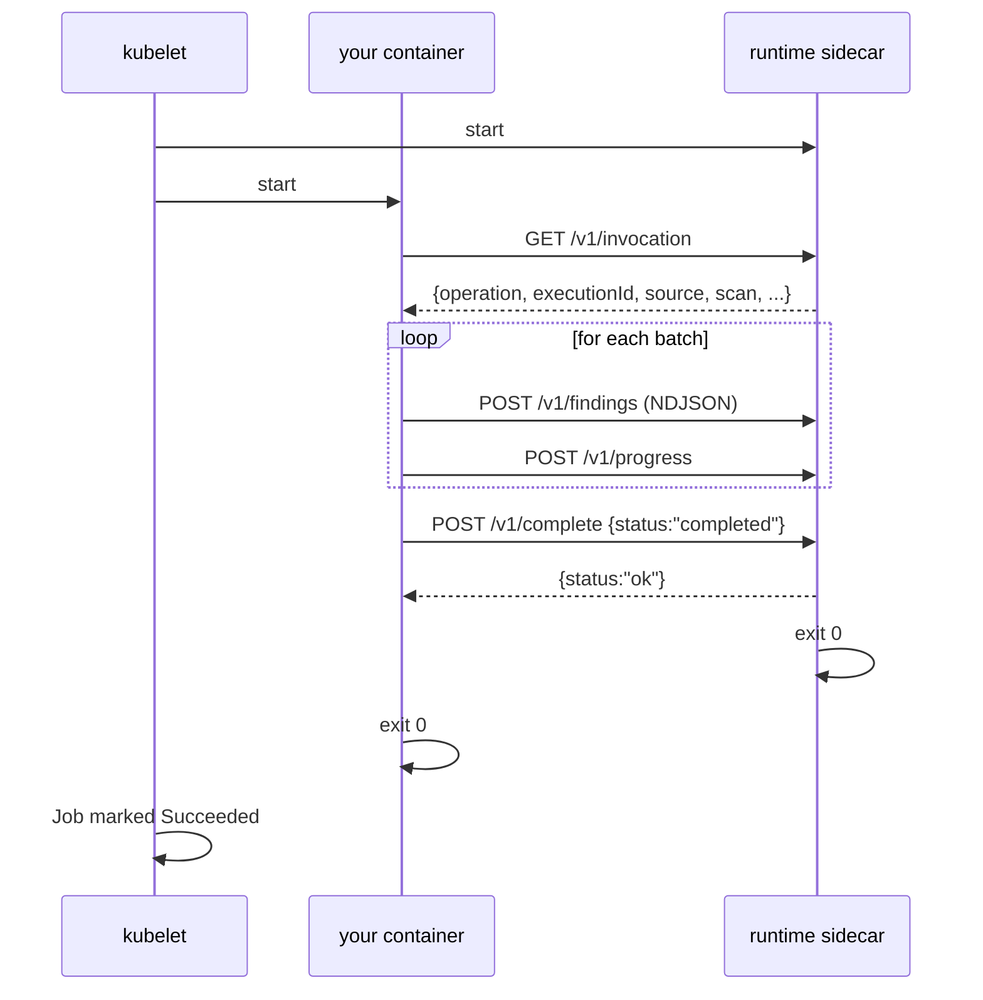

# Runtime contract — the sidecar HTTP API

Your connector container talks to a **runtime sidecar** that runs in the same pod, on `http://127.0.0.1:8089`. That's the only place your container needs to send anything. The sidecar takes care of forwarding to AA26's internal services, authentication, retries, OTel logs, and control-signal polling.

Use any HTTP client you want. `curl`, `requests`, `net/http`, `fetch`, `HttpClient` — all fine. The contract is what's documented here, not a particular SDK.

## The lifecycle



The two containers exit close to each other; the sidecar exits first, but that's fine — the kubelet waits for both.

## Endpoints

### `GET /v1/invocation`

What the framework wants you to do. Returns once, idempotent.

```bash
curl -s http://127.0.0.1:8089/v1/invocation
```

```json
{
  "operation": "scan",
  "executionId": "0e7c3a98-...",
  "sourceId":    "5b1d22f0-...",
  "source": {
    "accountUrl": "https://abc-xy12345.snowflakecomputing.com",
    "warehouse":  "DEMO_WH"
  },
  "scan": {
    "scanType": "access_scan"
  },
  "credentialsPath": "/etc/connector/credentials/credentials.json"
}
```

Dispatch on `operation`. The shape of `source` and `scan` is whatever your `connector.yaml` declared in `spec.source.schema` and `spec.scan.schema`.

### `POST /v1/findings`

Newline-delimited JSON. One envelope per line. Stream as much as you like — the sidecar handles backpressure.

```bash
cat <<'EOF' | curl -sf -X POST -H 'Content-Type: application/x-ndjson' --data-binary @- http://127.0.0.1:8089/v1/findings
{"schemaVersion":"1.0","kind":"finding","executionId":"...","occurredAt":"2026-05-05T20:00:00Z","type":"object_metadata","object":{"kind":"file","id":"/etc/hosts"}}
{"schemaVersion":"1.0","kind":"finding","executionId":"...","occurredAt":"2026-05-05T20:00:00Z","type":"access_grant","subject":{"kind":"principal","id":"alice"},"object":{"kind":"file","id":"/etc/hosts"},"predicate":{"permission":"read"}}
EOF
```

Returns `{"accepted": N}` where N is the line count it parsed. See **[finding schema](finding-schema.md)** for envelope details.

### `POST /v1/progress`

Tell AA26 how far along you are. Optional but improves UX for long scans.

```bash
curl -sf -X POST -H 'Content-Type: application/json' \
  -d '{"schemaVersion":"1.0","kind":"progress","executionId":"...","occurredAt":"2026-05-05T20:00:00Z","processed":1500,"total":12000,"message":"scanning catalog DEMO"}' \
  http://127.0.0.1:8089/v1/progress
```

`total` is optional — omit if you don't know the total ahead of time.

### `POST /v1/log`

Structured log. Forwarded to AA26's existing log pipeline (OTel → ClickHouse).

```bash
curl -sf -X POST -H 'Content-Type: application/json' \
  -d '{"schemaVersion":"1.0","kind":"log","executionId":"...","occurredAt":"2026-05-05T20:00:00Z","level":"warn","message":"slow query","attributes":{"warehouse":"DEMO_WH","ms":12000}}' \
  http://127.0.0.1:8089/v1/log
```

Levels: `debug | info | warn | error`. You can also just write to stdout/stderr — kubelet captures it — but `/v1/log` gets you structured fields and severity that the UI can filter on.

### `POST /v1/checkpoint` / `GET /v1/checkpoint`

Save your iterator so a paused or restarted scan can resume.

```bash
# Save state. Body is any JSON object.
curl -sf -X POST -H 'Content-Type: application/json' \
  -d '{"page":42,"cursor":"abc123"}' \
  http://127.0.0.1:8089/v1/checkpoint

# Read it back on restart. 204 if nothing saved.
curl -sf http://127.0.0.1:8089/v1/checkpoint
# {"page":42,"cursor":"abc123"}
```

Idempotent: each POST replaces the prior checkpoint. A pause-resume picks up from the last successful POST.

### `GET /v1/control` (long-poll)

Poll this in a background thread. Blocks up to 25 seconds, returns `{}` if there's nothing to do or `{"signal":"PAUSE"|"STOP"|"RESUME"}` if the user clicked the button.

```bash
# Pseudo-code: a control loop in your connector
while true:
  resp = GET /v1/control
  if resp.signal == "PAUSE":
    save_checkpoint()
    block until RESUME
  elif resp.signal == "STOP":
    save_checkpoint()
    POST /v1/complete {"status":"cancelled"}
    exit
```

If you don't poll, the framework sends SIGTERM after a 30s grace period on STOP. That works fine if you don't need graceful checkpointing.

### `POST /v1/process`

Kick off an "additional process" as a child execution. Use this when your connector wants to defer expensive work (classification of sample data, owner enrichment, etc.) to a follow-up handler.

```bash
curl -sf -X POST -H 'Content-Type: application/json' \
  -d '{"key":"enrich_owners","payload":{"principalIds":["alice","bob"]}}' \
  http://127.0.0.1:8089/v1/process
```

The `key` must match an entry in your `connector.yaml`'s `capabilities.additionalProcesses`.

### `POST /v1/complete`

You're done. Tell the framework how it went.

```bash
curl -sf -X POST -H 'Content-Type: application/json' \
  -d '{"status":"completed","summary":{"files":1500,"errors":0}}' \
  http://127.0.0.1:8089/v1/complete
```

`status` ∈ `{completed, failed, cancelled}`. Body is freeform — whatever's useful in the Scan Executions detail view. The sidecar exits shortly after responding to this call; the Job ends as soon as both your container and the sidecar are gone.

### `GET /healthz`

For probes. Returns `200 ok\n` once the sidecar is listening. Use this in your connector's startup loop to wait for the sidecar before doing anything else:

```bash
for i in $(seq 1 30); do
  curl -sf http://127.0.0.1:8089/healthz >/dev/null && break
  sleep 1
done
```

## Errors

The sidecar uses standard HTTP status codes. The body of an error is JSON: `{"error": "...", "details": "..."}`. The most common ones you'll hit:

| status | meaning | typical fix |
|---|---|---|
| 400 | malformed JSON, NDJSON line not parseable, unsupported `type` for findings | check the [finding schema](finding-schema.md), validate locally with `aa26-connector test` |
| 405 | wrong HTTP method | most endpoints are POST-only, except `/v1/invocation`, `/v1/checkpoint` GET, and `/v1/control` |
| 502/503 | downstream (AA26 internals) is sad | sidecar already retries; if you see this, surface in `POST /v1/log` and continue |

Connectors **should not** retry on their own — the sidecar handles retries to AA26 services. Returning an error to the connector is a "your input is wrong" signal, not a "try again later."

## What you can't do

- Talk to AA26 services directly (`data-ingestion`, `connector-state`, core-api, Redis). The sidecar is your boundary; it has the network policies and credentials.
- Listen on any other port than what's documented. The sidecar binds `127.0.0.1:8089`. If you need a port for your own thing (debug, profiling), use a different one and don't expose it.
- Assume the sidecar has any state from a prior run. Checkpoints are explicit; everything else resets.

## Coming next: `POST /v1/classify` (Phase 2)

Sensitive-data scans today work like this in stock AA26: the connector reads a file's content, base64-encodes it, and POSTs it to a classifier service (`data-classification`, or `evidence-ai-classifier` when Labs is installed). The classifier scores it for sensitive content (PII, credentials, etc.) and the connector includes the result in its findings.

In the new framework, that becomes one sidecar call:

```
POST /v1/classify
{
  "filename": "customers.csv",
  "contentType": "text/csv",
  "data": "<base64 of content>",
  "objectIdentifier": "snowflake://DEMO.PUBLIC.CUSTOMERS"
}
```

Response (shape stable across classifier backends):

```
{
  "matches": [
    { "type": "PII.email",     "confidence": "high",   "regions": [...] },
    { "type": "PII.creditCard", "confidence": "medium" }
  ],
  "classifierVersion": "evidence-ai/1.2.0",
  "tier2Queued": true
}
```

The sidecar handles which classifier to call based on cluster config. You don't pick a URL, you don't worry about V1 vs V2 fallback, you don't know whether Tier-2 (LLM review) is enabled — the sidecar abstracts all of that. If the operator switches from `data-classification` to `evidence-ai-classifier` later, your connector keeps working unchanged.

You then convert each `match` into a `sensitive_match` finding in the usual way:

```
POST /v1/findings
{ "kind": "finding", "type": "sensitive_match",
  "object": {"kind":"table","id":"snowflake://DEMO.PUBLIC.CUSTOMERS"},
  "predicate": {"match":"PII.email","classifier":"evidence-ai/1.2.0","confidence":"high"} }
```

This replaces the existing AA26 pattern where a mutating admission webhook (`evidence-ai-webhook`) injects a patched `handler.py` into every connector pod. With `/v1/classify`, the bridge moves into the sidecar — no admission webhook, no init container patching anyone's source, no per-language handler.py.

Status: **planned for Phase 2**. Current sidecar doesn't expose `/v1/classify` yet. Connectors that need to do sensitive-data classification today should emit `sensitive_match` findings with their own classification logic and accept that the result might be re-classified downstream by the operator's classifier of choice.
