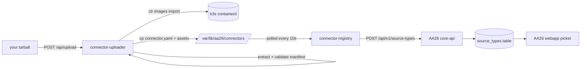

# Uploading a connector

The fastest path from "I built a connector" to "AA26 admins can use it" is the upload UI at `/connector-upload/` on your DSPM cluster.

You'll also see a **+ Add New Source** button in AA26's webapp under **Configuration → Sources → Create Source Group** that opens this page in a new tab.

## What you upload

A single `.tar.gz` bundle containing:

```
my-connector-0.1.0.tar.gz
├── connector.yaml        # required, validated against the JSON Schema
├── image.tar             # required, output of `docker save`
├── icon.svg              # optional
├── README.md             # optional
└── assets/               # optional, dropped alongside the manifest as-is
```

## The fast way: `aa26-connector package`

The CLI builds the bundle for you. From your connector's directory:

```bash
docker build -t localhost/my-connector:dev .
aa26-connector package
# → wrote my-connector-0.1.0.tar.gz (8.1 MB)
```

The CLI does the same three things you'd do by hand:

1. Validates `connector.yaml` against the JSON Schema (rejects early if the manifest is broken — better to fail here than mid-upload)
2. `docker save` the image referenced in `spec.image`
3. Bundles them with any optional assets/README/icon

## The slow way: do it by hand

```bash
# 1. Make sure your image is built and available locally.
docker build -t localhost/my-connector:dev .

# 2. Save the image.
docker save -o image.tar localhost/my-connector:dev

# 3. Tar everything together.
tar czf my-connector-0.1.0.tar.gz connector.yaml image.tar
```

## Upload

Two paths.

### Browser (recommended)

1. Open `/connector-upload/` (or click **+ Add New Source** in AA26)
2. Drag your `.tar.gz` onto the drop zone, or click **Browse**
3. Wait for the success banner — usually under 5 seconds
4. The new connector appears in the **Installed connectors** table immediately
5. Within ~10 seconds, AA26's connector picker shows it as a card with a "Custom" badge

### `curl` (for CI/automation)

```bash
curl -F "bundle=@my-connector-0.1.0.tar.gz" \
     https://<your-dspm-cluster>/connector-upload/api/upload
```

Response on success:

```json
{
  "name": "my-connector",
  "version": "0.1.0",
  "message": "Connector accepted. The registry will publish it to AA26 within 10 seconds."
}
```

On rejection you get an HTTP 400 with the schema error — same validator the registry uses, so "accepted by upload" means "will land cleanly in AA26."

## What happens behind the scenes



Each hop is independent — the uploader doesn't talk to AA26 directly. If `connector.yaml` is wrong the upload is rejected outright; if the image is wrong the import fails before anything is staged. By the time AA26's webapp sees the new card, the connector is fully wired.

## Updating an existing connector

Re-upload the same `name` with a different `version`. The registry treats existing-name as idempotent and the new row gets a new (name, version) tuple in postgres.

To replace the connector entirely (same version, new image), delete first then upload again.

## Deleting

Click the trash-can next to the connector in the **Installed connectors** table. This:
- Removes the manifest from `/var/lib/aa26/connectors/<name>/`
- Triggers the registry to drop the `source_types` row from AA26 on its next reconcile
- Leaves the image in containerd (harmless; takes ~150 MB; clean up with `k3s ctr images rm` if you really need to)

Built-in connectors (Active Directory, File Server, Entra ID, SharePoint Online) cannot be deleted from this UI — the trash button is disabled for them.

## Trust model (read this before uploading anything)

**The upload UI runs your container in the cluster's system context. There is no signature verification, no checksum, no allowlist.** This is intentional for the prototype.

What this means concretely:

- Anyone with HTTP access to the upload endpoint can load any image into the cluster
- Once registered, that image runs as the connector's pod identity (read access to AA26 postgres in some scenarios, network access to the access-analyzer namespace, …)
- A malicious connector could exfiltrate data, mine cryptocurrency, or interfere with other AA26 services

**Before you upload a connector you didn't write yourself**:

1. Read its source. Connector code is small (50–500 lines for most data sources). It's auditable.
2. Pin the image digest in `connector.yaml`'s `spec.image.digest` so you can verify the bundle hasn't been tampered with
3. Don't run untrusted bundles on production AA26 instances. Test environments only.

Phase 3 of the framework adds **cosign signature verification** and a curated registry of vetted connectors — uploads will require either a valid signature from a trusted issuer OR an explicit cluster-level opt-in for unverified bundles. That work is tracked but not yet implemented.

## Troubleshooting

- **"connector.yaml invalid"**: the manifest doesn't pass the JSON Schema. Run `aa26-connector validate` locally to see the same error in a friendlier form.
- **"image import failed"**: the `image.tar` in your bundle isn't a valid Docker image archive. Did `docker save` actually run? Check the file size — anything under 1 MB is suspicious.
- **Connector shows up in the upload UI as Ready, but not in AA26's webapp picker**: registry's `/status` shows `upsertStatus`. If it's `failed`, the message tells you why (auth, validation, network). Most often: core-api lost the local image after a prune — re-upload to re-import.
- **HTTP 413 (request too large)**: bundle is over 1 GB. Slim your image — multi-stage builds and `scratch`/`distroless` final stages typically halve the size.
